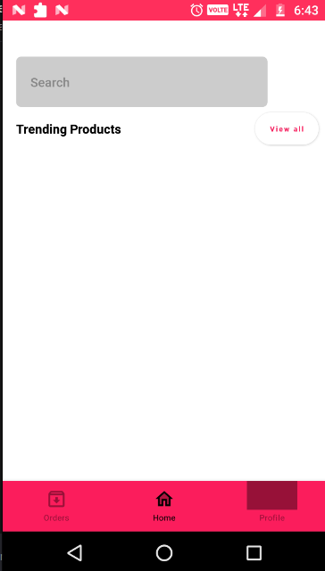
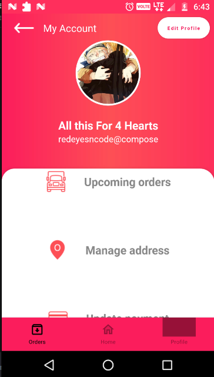
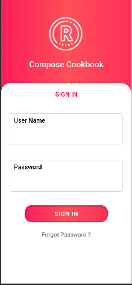

# Reboot-Me-Compose
Used Modern Development Toolkit i.e Jetpack Compose to Build Modern E-Commerce App (In Kotlin)

**Screenshots of the App Developed**

<table>
  <tr>
    <td>Bottom Navigation</td>
     <td>Otp Screen Preview</td>
   </tr>
  <tr>
    <td></td>
    <td></td>
  </tr>
   
 </table>

<table>
 <tr>
    <td>Profile Screen</td>
     <td>Sign Screen</td>
   </tr>
  <tr>
    <td></td>
    <td></td>
  </tr>
 </table>

